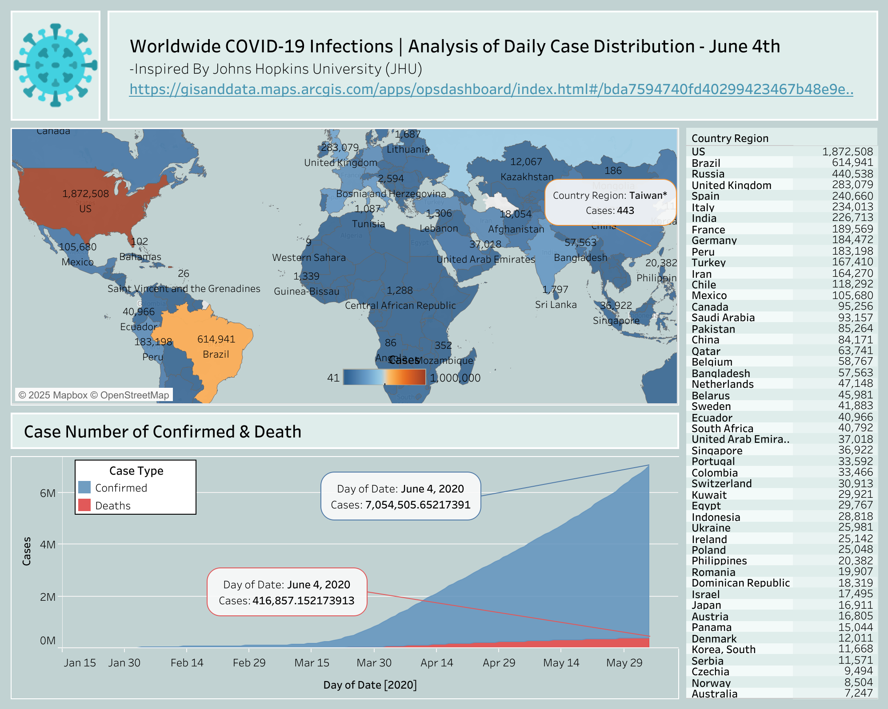

# Covid-19 global infections analysis

This project shows a visual analysis of global COVID-19 cases as of June 4th, 2020, inspired by data from Johns Hopkins University (JHU). It highlights the distribution of confirmed cases and deaths across countries, providing both a geographic heatmap and a time-series comparison of case trends.

[Link to Tableau dashboard](https://public.tableau.com/shared/DDZM5C7CJ?:display_count=n&:origin=viz_share_link)

#### Data key features:
1. Interactive world Map showing total confirmed cases per country.
2. Time-Series Graph tracking the number of confirmed and death cases from January to June 4, 2020.
3. Confirmed Cases vs. Deaths clearly separated using color-coded areas.
4. Data resource obtained from Johns Hopkins University (JHU).

#### Data dashboard preview: 

